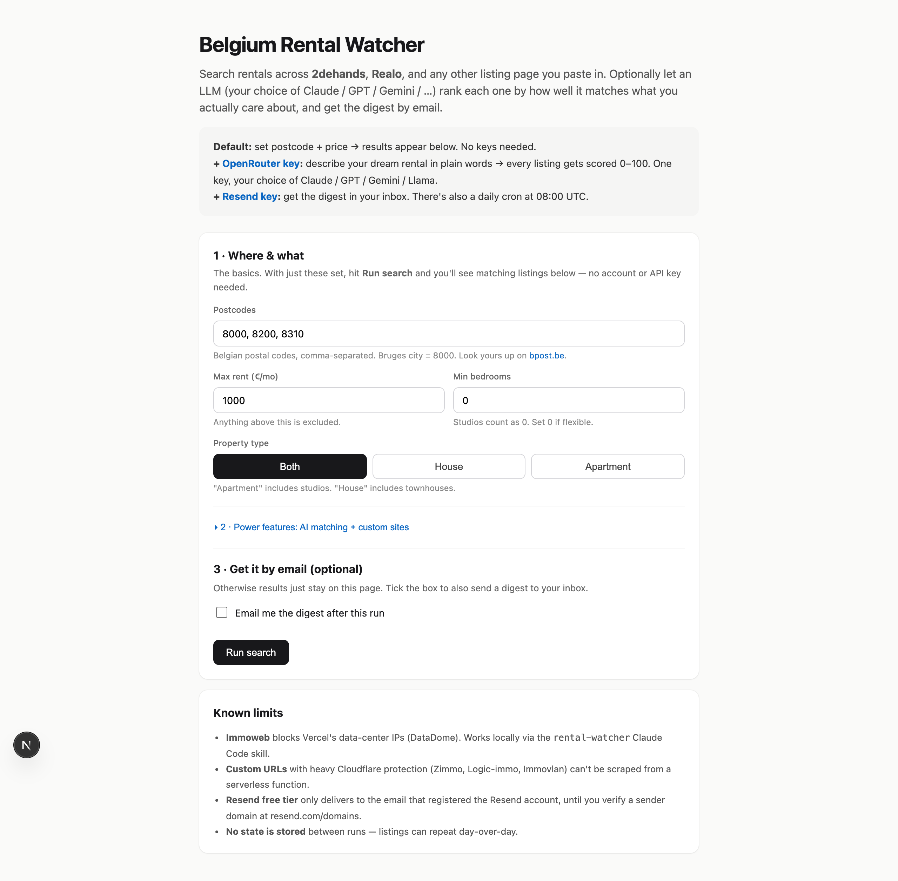

# Belgium Rental Watcher

> Search rentals across the major Belgian immo sites, let an LLM rank each listing against a free-text description of what you actually want, get a daily email digest. **No accounts, no state stored, bring your own keys.**

[](https://vercel.com/new/clone?repository-url=https%3A%2F%2Fgithub.com%2Fsimon324%2Fbelgium-rental-watcher&env=WATCH_POSTAL_CODES,WATCH_MAX_PRICE,OPENROUTER_API_KEY,RESEND_API_KEY,NOTIFY_EMAIL&envDescription=Optional%20—%20see%20.env.example%20for%20all%20vars&project-name=belgium-rental-watcher&repository-name=belgium-rental-watcher)
[](LICENSE)

🌐 **Live demo:** <https://belgium-rental-watcher.vercel.app>



## Why this exists

The "alert" emails Belgian immo sites send are useless. They ping you on **everything** in a price range, not on whether the place actually fits you. So you scroll 30 listings every morning to maybe like one, and by the time you book a viewing the good ones are already gone.

This tool flips that:

- You type postcodes, max rent, and a plain-English description of what you actually want ("near the canal, no ground floor, room for a desk")
- It scrapes the main sites in parallel
- An LLM (your choice — Claude, GPT, Gemini, …) scores each listing 0–100 against your description and writes a 1-line pitch
- You get one ranked email per day, top matches first

## Who is this for

- People apartment-hunting in Belgium who want signal over noise
- Anyone who has refreshed Immoweb 30 times today and is annoyed about it
- Developers who want to fork it and adapt to another country (NL, FR, DE rental markets work the same way structurally)

## When NOT to use this

- You're looking outside Belgium (postcode validation expects 4-digit BE codes)
- You need real-time alerts (cron is daily; for instant pings you'd want a different design)
- You expect coverage of Cloudflare-protected sites (Zimmo, Logic-immo, Immovlan) out of the box — see [Ideas](#ideas--wanted-contributions) for how to add that

## What it scrapes

| Source | Method | Notes |
|---|---|---|
| **2dehands.be** | JSON API | Filtered by real posting date (last 24h) |
| **Realo.be** | HTML parse | Top 20 newest by listing ID |
| **Immoweb.be** | HTML parse | DataDome blocks Vercel egress; works locally |
| **Any URL you paste** | LLM extraction | Claude/GPT/etc. reads the HTML and pulls listings |

## Quick start

### Option 1: Use the hosted demo

1. Open <https://belgium-rental-watcher.vercel.app>
2. Type postcodes + max rent → **Run search**
3. (Optional) Open Advanced, paste an [OpenRouter key](https://openrouter.ai/keys), write what you want in free text
4. (Optional) Tick "Also email", paste a [Resend key](https://resend.com), get a digest

Nothing is stored. Keys are sent server-side once per request, never persisted, never logged.

### Option 2: Deploy your own (1 click)

[](https://vercel.com/new/clone?repository-url=https%3A%2F%2Fgithub.com%2Fsimon324%2Fbelgium-rental-watcher&env=WATCH_POSTAL_CODES,WATCH_MAX_PRICE,OPENROUTER_API_KEY,RESEND_API_KEY,NOTIFY_EMAIL&envDescription=Optional%20—%20see%20.env.example%20for%20all%20vars&project-name=belgium-rental-watcher&repository-name=belgium-rental-watcher)

### Option 3: Local dev

```bash
git clone https://github.com/simon324/belgium-rental-watcher
cd belgium-rental-watcher
npm install
cp .env.example .env.local   # then fill in keys you want
npm run dev                  # http://localhost:3000
```

One-off CLI check:

```bash
npm run check -- --postcodes 8000,8200 --max 1200 --type apartment \
  --prefs "near canal, quiet, no ground floor" \
  --openrouter sk-or-v1-... \
  --email you@example.com --resend re_...
```

## Configuration

All optional. Set as env vars on Vercel (Settings → Environment Variables) or in `.env.local`.

| Var | Used for |
|---|---|
| `WATCH_POSTAL_CODES` | comma-separated, e.g. `8000,8200,8310` |
| `WATCH_MAX_PRICE` | EUR/mo, e.g. `1000` |
| `WATCH_PROPERTY_TYPE` | `house`, `apartment`, or `both` |
| `WATCH_MIN_BEDROOMS` | integer (studios = 0) |
| `WATCH_URLS` | comma-separated rental URLs for LLM extraction |
| `WATCH_PREFERENCES` | free-text match preferences |
| `WATCH_LLM_MODEL` | OpenRouter model id (default: `anthropic/claude-haiku-latest`) |
| `OPENROUTER_API_KEY` | enables LLM features for the cron |
| `RESEND_API_KEY` | enables email for the cron |
| `NOTIFY_EMAIL` | daily-cron recipient |
| `RESEND_FROM` | sender, default `onboarding@resend.dev` |
| `CRON_SECRET` | random string; protects `/api/cron` |

The cron in [`vercel.json`](./vercel.json) hits `/api/cron` every morning at 08:00 UTC.

## Architecture

```
app/
  api/cron/    GET   daily cron entrypoint (auth via CRON_SECRET)
  api/check/   POST  on-demand run; reads body params for criteria
  api/status/  GET   exposes config + model presets
  page.tsx     single-page UI with form + inline results
lib/
  scrapers/    one file per site (immoweb, realo, tweedehands)
  llm.ts       OpenRouter wrapper (extract listings + score matches)
  runner.ts    scrape → recency filter → LLM rank → email
  email.ts     Resend digest
  config.ts    criteria + env loading + per-request overrides
vercel.json    cron schedule
```

## Ideas & wanted contributions

These are real product gaps. None of them require deep familiarity with the codebase — they're scoped enough to fit a weekend or a focused evening. PRs welcome; or just open an issue with a sketch and I'll point you to the right files.

### 🚧 1. Local-Docker scraper to bypass DataDome / Cloudflare

**Problem:** Immoweb, Zimmo, Logic-immo and Immovlan block plain-fetch from Vercel egress IPs (Cloudflare Turnstile + DataDome). That's ~40% of Belgium's rental supply we currently can't reach when deployed on a serverless host.

**Idea:** A separate Docker service that runs Playwright or [Firecrawl](https://www.firecrawl.dev/) (or [Browserless](https://www.browserless.io)) on a residential-IP machine — a Raspberry Pi at home, a small VPS, or Firecrawl's hosted service. The Next.js app calls it as another scraper. From a residential IP these sites stop fingerprinting you.

**Files to look at:** `lib/scrapers/types.ts` (Scraper interface), `lib/scrapers/index.ts` (registry), `lib/scrapers/realo.ts` (cleanest example to copy from).

### 🔁 2. Cross-day deduplication

**Problem:** No state is stored between runs, so the same listing can appear in your inbox three mornings in a row.

**Idea:** Add an optional storage backend (Vercel KV, Upstash Redis, or a flat JSON file in Vercel Blob). Store seen listing IDs with a 14-day TTL. Skip listings already emailed in the last N days. Make it opt-in via env var so the no-state default still works.

**Files to look at:** `lib/runner.ts` (where `recent` is computed), introduce `lib/store.ts` and call it before email send.

### 🗺️ 3. Map view + distance-to-POI filter

**Problem:** Listings show a postcode, but not how close they are to "the canal" or "my office" or "Gent-Sint-Pieters station".

**Idea:** Add a `WATCH_NEAR` env var ("Gent-Sint-Pieters station, 2km") that geocodes the POI, then filters/scores by haversine distance. Add a map preview to the UI (Leaflet + OpenStreetMap tiles, no API key needed).

### 📉 4. Price drop detection

**Problem:** Currently we only see "new in the last 24h". Listings whose price drops two weeks in are invisible.

**Idea:** Persist `{listing_id → price history}`. On each run, flag any listing whose price dropped >5% vs. the prior snapshot. Surface as a "📉 Price drop" badge in the email.

### 🖼️ 5. Image-based match scoring

**Problem:** "Modern bathroom" or "lots of light" can't be assessed from listing metadata — only from photos.

**Idea:** Pull the first 3 listing photos, send them to Claude or Gemini Vision, score them against your preferences ("Are these signs of a modern interior?"). Add as an optional pass after the text scoring. Cost: ~$0.005 per listing, gated behind a UI checkbox.

### 📱 6. Telegram / WhatsApp / Discord notifications

**Problem:** Email is fine but slow. Belgian apartment-hunters mostly live in Telegram and WhatsApp.

**Idea:** Add a notifier interface alongside `lib/email.ts`. First implementations: Telegram bot (5 lines via `fetch`), Discord webhook (1 line). WhatsApp via Twilio is more involved.

### 🌐 7. Multi-country support

**Problem:** Hardcoded to Belgian postcodes (4 digits) and Belgian sites.

**Idea:** Make the country a first-class config (`WATCH_COUNTRY=BE|NL|FR|DE`). Each country gets its own `scrapers/` subfolder. The Netherlands has Pararius + Funda + Marktplaats; France has SeLoger + LeBonCoin; Germany has Immobilienscout24.

### 🔍 8. Browser extension

**Problem:** When manually browsing Immoweb, you can't see your LLM-match score on a listing without copy-pasting the URL into the tool.

**Idea:** A small Chrome/Firefox extension that, on any Immoweb/Realo/Zimmo listing page, calls `/api/check?urls=<current-url>` and overlays the score + summary as a badge in the corner.

### Smaller hacks (good first issues)

- **Postcode autocomplete** — bpost has a public CSV; turn the input into a typeahead
- **i18n** — currently English-only; Dutch (NL-BE) and French (FR-BE) would help adoption
- **Better error UX** — surface scraper-level errors more visibly in the inline results
- **CLI: `--cities brussels,ghent`** — translate city names to postcode lists for users who don't know their target postcode
- **Export to CSV / iCal** — useful for spreading viewings across a week

If you ship one of these, **mention it in an issue or PR and I'll add you to the credits below.**

## Known rough edges

- **Immoweb 403s from Vercel** (DataDome). Works fine locally. See Ideas #1 for the fix.
- **No dedup across days** — see Ideas #2.
- **Resend free-tier** only delivers to the email that registered the account, until you [verify a sender domain](https://resend.com/domains).
- **2dehands inventory is thin** for rentals ≤€1000; most matches come from Realo.

## Credits

Built by [@simon324](https://github.com/simon324). Inspired by a friend's 11pm-Sunday inbox screenshot.

Contributors:
- Your name here ↑

## License

MIT. Build whatever you want with it.
